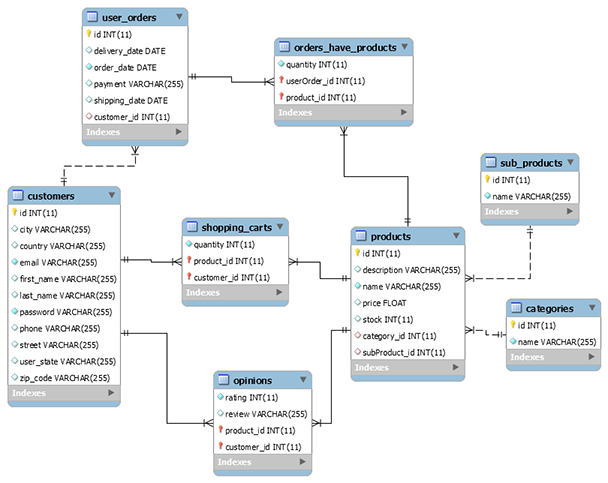

# Store Manager
This project implements a typical e-commerce backend for managing the database, providing Java methods to store and retrieve data.

## Getting Started

[Persistence.xml](src/main/resources/META-INF/persistence.xml) contains the database parameters. The user and password set in this file are not secure and they should be replaced in a production server. The file also contains the *Table Generation Strategy* set to *create* by default, which is no longer needed once the tables are initiated in the database and it needs to be deleted to avoid warnings while executing the code.

The following diagram is created:

